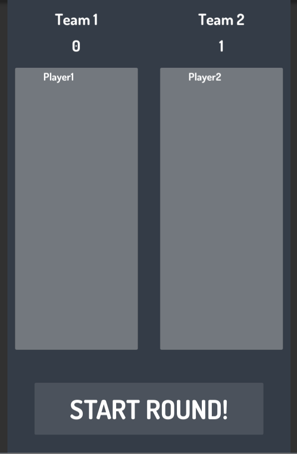

# MusicRivals
Music game 2 players - 1 mobile device. 
Simple UI based game, where you create 2 teams (min. players 2). 
Goal is to integrate, so 2 players answers on one mobile device (guess the song name and title). 
## Table of Contents

- [Game Rules](#game-rules)
- [Demo gif](#demo-gif) 

## Game rules #
1. Add players to the game (min. 2)
2. Choose music category(mix, pop, rock), each category has 15 songs.
3. Teams will be created automatically after you confirm your players and category
4. Players from each team plays versus each other, guessing name of the song while others might or might not help them.
  -each 1v1 ends after 3 songs and next players are chosen 
5. Game end after last song is played.

## Demo gif
### Start Menu

### Gameplay

